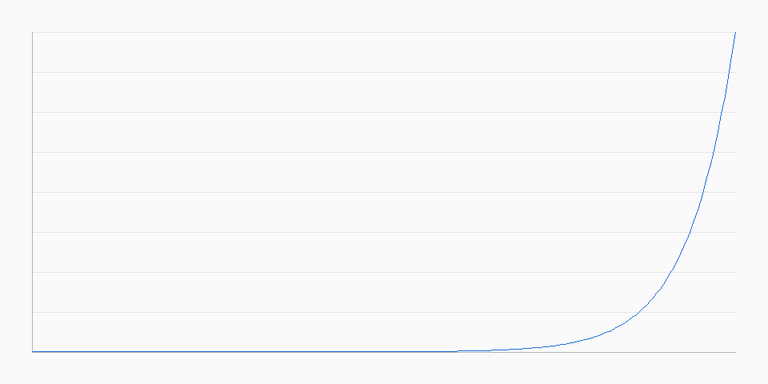

# 周调仓中期动量策略回测报告

## 策略定义
- 股票池：沪深300（当前为 mock 占位）
- 信号：`score = 0.5 * mom60 + 0.5 * mom120`（t 日收盘计算）
- 调仓：每周一次，t+1 开盘成交
- 成本：buy=0.0008, sell=0.0018

## 回测指标
- 区间总收益：181145552.36%
- 年化收益：3239.59%
- 年化波动：12.98%
- Sharpe：249.5687
- 当前回撤：0.00%
- 最大回撤：-1.51%
- 平均换手：1.35%
- 成本占比：0.11%
- 调仓次数：207

## 净值曲线

## 未来函数检查
- 信号日期：t（收盘后）
- 交易日期：t+1（下一交易日开盘）
- 回测引擎已强制按上述顺序执行